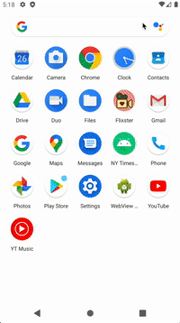

# Assignment 1 - *Flixster*

Flixster is an android application that allows users to browse a list of movies currently playing in theaters.

Submitted by: Sharon Wong

Time spent: 8 hours spent in total

## User Stories

The following **required** features are completed:
* [x] User can view a list of movies (title, poster image, and overview) currently playing in theaters from the Movie Database API.

The following **optional** features are implemented:
* [x] Views should be responsive for both landscape/portrait mode.
- In portrait mode, the poster image, title, and movie overview is shown.
- In landscape mode, the rotated alternate layout should use the backdrop image instead and show the title and movie overview to the right of it.
* [x] Display a nice default placeholder graphic for each image during loading.
* [x] Improve the user interface through styling and coloring
* [x] * For popular movies (i.e. a movie voted 8 stars or more), the full backdrop image is displayed. Otherwise, a poster image, the movie title, and overview is listed.
  
## Video Walkthrough

Walkthrough for viewing a list of movies currently playing in theaters from the Movie Database API, as well as additional styling and full backdrop image for popular movies

Walkthrough for responsive landscape and portrait views

Walkthrough for default placeholder graphic during loading

Gifs created with [Kap](https://getkap.co/)

## Notes

I made the most popular movies require over 8 stars, because most of the movies were over 5 stars (except for one), and it wouldn't display some of the user stories well.

I had difficulty capturing the placeholder image in action, because the app liked to load all at once. Technically, I did implement it and I did see it sometimes, but not consistently to capture in a gif.

## License

    Copyright 2021 Sharon Wong
    
    Licensed under the Apache License, Version 2.0 (the "License");
    you may not use this file except in compliance with the License.
    You may obtain a copy of the License at
    
        http://www.apache.org/licenses/LICENSE-2.0
    
    Unless required by applicable law or agreed to in writing, software
    distributed under the License is distributed on an "AS IS" BASIS,
    WITHOUT WARRANTIES OR CONDITIONS OF ANY KIND, either express or implied.
    See the License for the specific language governing permissions and
    limitations under the License.