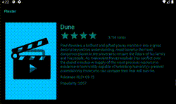

# Flix (TF Submission)
Flix is an app that allows users to browse movies from the [The Movie Database API](http://docs.themoviedb.apiary.io/#).

📝 `NOTE - PASTE PART 2 SNIPPET HERE:` Paste the README template for part 2 of this assignment here at the top. This will show a history of your development process, which users stories you completed and how your app looked and functioned at each step.

---

## Flix Part 1

### User Stories

#### REQUIRED (10pts)
- [x] (10pts) User can view a list of movies (title, poster image, and overview) currently playing in theaters from the Movie Database API.

#### BONUS
- [x] (2pts) Views should be responsive for both landscape/portrait mode.
  - [x] (1pt) In portrait mode, the poster image, title, and movie overview is shown.
  - [x] (1pt) In landscape mode, the rotated alternate layout should use the backdrop image instead and show the title and movie overview to the right of it.

- [x] (2pts) Display a nice default [placeholder graphic](https://guides.codepath.org/android/Displaying-Images-with-the-Glide-Library#advanced-usage) for each image during loading
- [x] (2pts) Improved the user interface by experimenting with styling and coloring.
- [x] (2pts) For popular movies (i.e. a movie voted for more than 5 stars), the full backdrop image is displayed. Otherwise, a poster image, the movie title, and overview is listed. Use Heterogenous RecyclerViews and use different ViewHolder layout files for popular movies and less popular ones.

### App Walkthough GIF

Placeholder Walkthrough



Other walkthroughs below.

### Notes


It takes a lot of time testing on "bad internet", because Glide caches images it loads. I ended up having to delete the cache every time I wanted to get a gif.

### Open-source libraries used

- [Android Async HTTP](https://github.com/codepath/CPAsyncHttpClient) - Simple asynchronous HTTP requests with JSON parsing
- [Glide](https://github.com/bumptech/glide) - Image loading and caching library for Androids


----

# Flix
Flix is an app that allows users to browse movies from the [The Movie Database API](http://docs.themoviedb.apiary.io/#).

## Flix Part 2

### User Stories

#### REQUIRED (10pts)

- [x] (8pts) Expose details of movie (ratings using RatingBar, popularity, and synopsis) in a separate activity.
- [x] (2pts) Allow video posts to be played in full-screen using the YouTubePlayerView.

#### BONUS

- [x] Implement a shared element transition when user clicks into the details of a movie (1 point).
- [x] Trailers for popular movies are played automatically when the movie is selected (1 point).
    - [x] When clicking on a popular movie (i.e. a movie voted for more than 5 stars) the video should be played immediately.
    - [x] Less popular videos rely on the detailed page should show an image preview that can initiate playing a YouTube video.
- [x] Add a play icon overlay to popular movies to indicate that the movie can be played (1 point).
- [x] Apply data binding for views to help remove boilerplate code. (1 point)
- [x] Add a rounded corners for the images using the Glide transformations. (1 point)

### App Walkthough GIF


Gifs created with [Kap](https://getkap.co/)

### Notes

I couldn't find a lot of recent examples for Android Studio and how it interacts with Youtube API Player. Eventually I found out how to force the video into landscape mode every time and how to instantly play it (using the `loadVideo` instead of `cueVideo` function), but I couldn't find a coherent explanation on how to make a custom fullscreen layout. In any case, the YoutubeVideoPlayer works best if the app was in landscape mode already. Portrait mode expanding into full screen experienced a lot of hiccups. 

Working with the Youtube API Player was a little frustrating. Sometimes, it would suddenly stop working, reporting an initialization error that ended up being "fixed" if I removed the youtube service start query in the manifest, quit the app, put the query back in, and restarted the app. Other times, some videos would be stuck on a perpetually black processing screen and I had to restart the app to try to get it to load, while other videos (the popular videos) actually worked.

A note about Glide Transformations: the most recent version of Glide handles a number of transformations without the need for the additional library. The implementation looks like this:

```
Glide.with(view.getContext())
.load(url)
.placeholder(R.drawable.ic_baseline_movie_24)
.transform(new CenterInside(), new RoundedCorners(20))
.into(view);
```

I initially used the library recommended in the guides but found out it added a lot of unnecessary padding/margins on my image and ended up discovering that the Glide library supported Rounded Corners in a cleaner way.

I really liked data binding and implemented it to some degree to cut down the number of `findViewById` I used, but when it came to trying to do events/listeners data-binding, I couldn't figure out a good way to convert my implementation of the onClick events into handlers I could extract to another file or move to MovieAdapter, because the event needed to be executed in context of the ViewHolders. A lot of the examples I ended up finding weren't RecyclerViews (much less with multiple ViewHolders) or used Kotlin.

## Open-source libraries used
- [Android Async HTTP](https://github.com/codepath/CPAsyncHttpClient) - Simple asynchronous HTTP requests with JSON parsing
- [Glide](https://github.com/bumptech/glide) - Image loading and caching library for Android

---

## Flix Part 1

### User Stories
#### REQUIRED (10pts)
- [x] (10pts) User can view a list of movies (title, poster image, and overview) currently playing in theaters from the Movie Database API.

#### BONUS
- [x] (2pts) Views should be responsive for both landscape/portrait mode.
    - [x] (1pt) In portrait mode, the poster image, title, and movie overview is shown.
    - [x] (1pt) In landscape mode, the rotated alternate layout should use the backdrop image instead and show the title and movie overview to the right of it.

- [ ] (2pts) Display a nice default [placeholder graphic](https://guides.codepath.org/android/Displaying-Images-with-the-Glide-Library#advanced-usage) for each image during loading
- [x] (2pts) Improved the user interface by experimenting with styling and coloring.
- [x] (2pts) For popular movies (i.e. a movie voted for more than 5 stars), the full backdrop image is displayed. Otherwise, a poster image, the movie title, and overview is listed. Use Heterogenous RecyclerViews and use different ViewHolder layout files for popular movies and less popular ones.

### App Walkthough GIF

Walkthrough for viewing a list of movies currently playing in theaters from the Movie Database API, as well as additional styling and full backdrop image for popular movies


Walkthrough for responsive landscape and portrait views


Walkthrough for default placeholder graphic during loading


Gifs created with [Kap](https://getkap.co/)


### Notes
I made the most popular movies require over 8 stars, because most of the movies were over 5 stars (except for one), and it wouldn't display some of the user stories well.

I had difficulty capturing the placeholder image in action, because the app liked to load all at once. Technically, I did implement it and I did see it sometimes, but not consistently to capture in a gif.

Edit: Tried to make placeholder work. Things I did include: setting different network speeds in the Virtual Device Manager, making configuration a separate get request (instead of hardcoding the url), and attempted to clear Glide's memory and disk cache (but failed). I think Glide's cache'ing images, so it never actually fetches the images from the url.

### Open-source libraries used

- [Android Async HTTP](https://github.com/codepath/CPAsyncHttpClient) - Simple asynchronous HTTP requests with JSON parsing
- [Glide](https://github.com/bumptech/glide) - Image loading and caching library for Androids